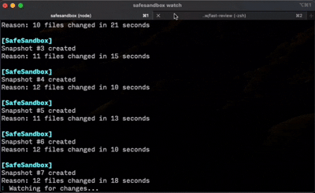

# SafeSandbox

> **Infinite undo for AI coding agents.**

SafeSandbox is a local-first CLI tool that automatically creates git snapshots while AI coding agents (Cursor, Claude Code, Codex, Aider, etc.) modify your repository. If an agent breaks something, roll back in seconds.

<p align="center">
  
</p>
<p align="center">
  <em>Auto-captures every AI edit — rollback in seconds with one command.</em>
</p>

## What it does

- **Automatic snapshots** — detects bursts of file changes and creates restore points
- **Manual snapshots** — pin a named checkpoint before a risky prompt
- **Rollback** — restore your full codebase (including new files) to any snapshot
- **Timeline** — view a human-readable history of what changed
- **Prune** — clean up old snapshots to keep the repo lean over months of use
- **Status** — see snapshot count, last snapshot, and branch size at a glance
- **Agent rules** — writes `AGENTS.md` with guardrails readable by all major AI agents

## What it is NOT

- Not a cloud service — everything stays on your machine
- Not a remote IDE, Docker container, or AI model
- Not a replacement for `git commit` — it's a safety net between commits

## What it IS

- A local CLI tool
- A filesystem watcher (via chokidar)
- A git-based snapshot manager with no impact on your main branch history

## Installation

```bash
npm install -g safesandbox
# or
pnpm add -g safesandbox
```

Or run without installing:

```bash
npx safesandbox init
```

## Quick Start

```bash
# 1. Initialize SafeSandbox in your repo
cd my-project
safesandbox init

# 2. Pin a checkpoint before a risky prompt
safesandbox snapshot "before auth refactor"

# 3. Start watching for automatic snapshots
safesandbox watch

# 4. Let your AI agent work...
# SafeSandbox auto-creates snapshots when it detects bursts of edits

# 5. View history
safesandbox timeline

# 6. Roll back if something goes wrong
safesandbox rollback latest   # most recent snapshot
safesandbox rollback 3        # specific snapshot by ID
```

## Commands

### `safesandbox init`

Sets up SafeSandbox in the current repository. Creates:

- `.safesandbox/` directory with metadata and config
- A hidden snapshot branch (`safesandbox/snapshots`) for internal commits
- `AGENTS.md` with guardrails for AI agents (Cursor, Claude Code, Codex, Aider)

### `safesandbox watch`

Starts filesystem monitoring and auto-creates snapshots when it detects a burst of changes:

- Multiple rapid file changes (configurable threshold)
- Deleted files
- Important file changes: `package.json`, lockfiles, `Dockerfile`, `.env`, config files

```
[SafeSandbox]
Snapshot #3 created
Reason: 12 files changed in 6 seconds
```

### `safesandbox snapshot [memo]`

Manually create a named snapshot at any moment — useful before a large or risky prompt:

```bash
safesandbox snapshot "before adding payments"
```

### `safesandbox timeline`

Shows snapshot history, newest first:

```
#3 — 12 files changed in 6 seconds    2m ago
#2 — package.json modified             8m ago
#1 — before adding payments           15m ago
```

### `safesandbox status`

Shows snapshot count, last snapshot info, branch size, and config. Also warns if cleanup is recommended:

```
SafeSandbox status

  Snapshots   42 (last: #42 — 14 files changed in 6 seconds  2m ago)
  Branch      ✓ safesandbox/snapshots
  Pack size   1.2 MB

  Config:
    thresholdFiles:   5
    thresholdSeconds: 10
    maxSnapshots:     100
```

### `safesandbox prune`

Delete old snapshots to keep the repo lean. Runs `git gc` automatically after pruning:

```bash
safesandbox prune --keep 50          # keep the 50 most recent
safesandbox prune --older-than 7d    # delete snapshots older than 7 days
safesandbox prune --keep 50 --force  # skip confirmation
```

### `safesandbox rollback <id>`

Restores the full repository to the state at snapshot `<id>`. Also removes any files that didn't exist at that snapshot.

```bash
safesandbox rollback latest    # most recent snapshot
safesandbox rollback 3         # specific ID
safesandbox rollback 3 --force # skip confirmation (for scripts)
```

If you have uncommitted changes, SafeSandbox creates an emergency backup snapshot before rolling back.

## How it works

SafeSandbox uses **git internally** — no extra storage format:

- A hidden branch (`safesandbox/snapshots`) stores snapshot commits
- `git add --all` + `git write-tree` captures the full tree including untracked files
- Rollback uses `git checkout` + cleanup of files not present in the target snapshot
- Metadata in `.safesandbox/meta.json` maps snapshot IDs to commit hashes

No Docker. No overlayfs. No cloud. Just your local git repo.

## Configuration

After `init`, edit `.safesandbox/config.json` to tune behavior:

```json
{
  "thresholdFiles": 5,
  "thresholdSeconds": 10,
  "maxSnapshots": 200,
  "ignoredPaths": ["node_modules", ".git", "dist", "build", ".safesandbox"]
}
```

| Field | Default | Description |
|---|---|---|
| `thresholdFiles` | `5` | Minimum files changed to trigger an auto-snapshot |
| `thresholdSeconds` | `10` | Debounce window — waits this long after the last change before snapshotting |
| `maxSnapshots` | `200` | Auto-prune: keep only the N most recent snapshots |
| `ignoredPaths` | see above | Paths to exclude from the watcher (`.gitignore` is also respected automatically) |

## Example session

```bash
$ cd my-cursor-project
$ safesandbox init
✓ SafeSandbox initialized
  Snapshot branch: safesandbox/snapshots
  Metadata: /Users/me/my-cursor-project/.safesandbox
  Agent rules: AGENTS.md

$ safesandbox snapshot "before auth refactor"
✓ Snapshot #1 created
  Reason: before auth refactor

$ safesandbox watch
⠿ Watching for changes...

# ... Cursor adds 14 files for the auth feature ...

[SafeSandbox]
Snapshot #2 created
Reason: 14 files changed in 8 seconds

# ... you ask Cursor to clean up and it deletes something important ...

[SafeSandbox]
Snapshot #3 created
Reason: 5 files changed in 4 seconds

$ safesandbox timeline
#3 — 5 files changed in 4 seconds     12s ago
#2 — 14 files changed in 8 seconds    45s ago
#1 — before auth refactor              2m ago

$ safesandbox rollback 1
Rolling back to snapshot #1
...
Continue? [y/N] y
✓ Rolled back to snapshot #1
```

## Requirements

- Node.js >= 20
- Git repository (`git init` first if needed)

## License

MIT
